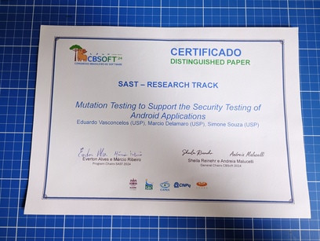

Title: Mutation Testing to Support the Security Testing of Android Applications
Date: 2024-10-02 00:00
Category: Papers

Meu artigo _Mutation Testing to Support the Security Testing of Android Applications_ foi publicado e recebeu o prêmio de _distinguished paper_ no [CBSOFT'24](https://cbsoft.sbc.org.br/2024/sast/artigos/?lang=en).

Você pode baixar uma cópia gratuita desse paper diretamente dos seguintes repositórios:

- [USP](https://repositorio.usp.br/item/003230573)
- [SBC](https://sol.sbc.org.br/index.php/sast/article/view/30213)

_Obs.: a publicação real deste post ocorreu em 18 de março de 2026. Entretanto, a data de publicação original na minha antiga página pessoal, em 2 de outubro de 2024, foi preservada aqui._
